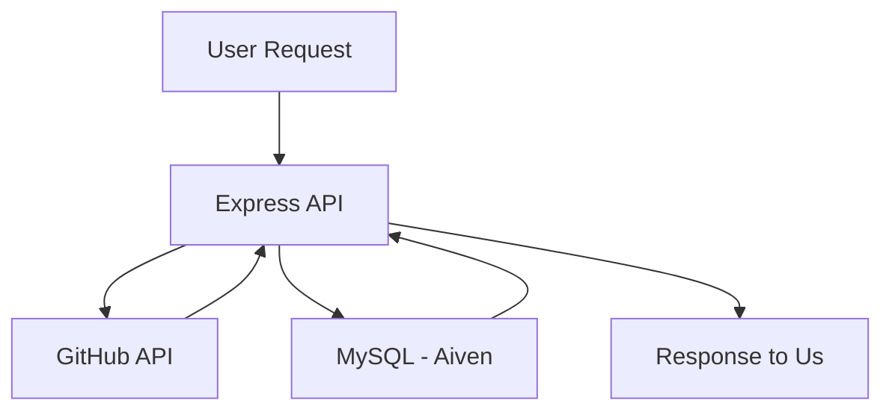

# 🚀 GitHub Profile Analyzer API

> A scalable backend service built with Node.js that fetches, analyzes, and stores GitHub user profile data using a cloud-hosted MySQL database.

---

## 🌐 Live API

🔗 **API Base URL:**  
https://github-profile-analyzer-api-2ug6.onrender.com

---

## 📌 Project Overview

The **GitHub Profile Analyzer API** is a backend application that integrates with the **GitHub Public REST API** to fetch user profile data, extract valuable insights, and store them in a **cloud-hosted MySQL database (Aiven)**.

This project demonstrates:
- API integration
- Backend development using Express.js
- Cloud database management
- RESTful API design

---


## 🧩 Application Flow


---

## 🎯 Objective

- Fetch public GitHub profile data using a username  
- Analyze useful metrics (followers, repos, etc.)  
- Store analyzed data in MySQL  
- Provide APIs to retrieve stored results  

---

## 🧰 Tech Stack

- ⚡ Node.js  
- 🚀 Express.js  
- 🗄️ MySQL (Aiven Cloud Database)  
- 🌐 GitHub REST API  
- ☁️ Render (Deployment Platform)  

---

## ✨ Features

- 🔍 Fetch GitHub profile by username  
- 📊 Analyze key insights:
  - Public repositories count  
  - Followers & Following  
  - Profile details (name, bio, URL)  
- 💾 Store data in cloud database  
- 📡 REST APIs for data retrieval  
- ⚠️ Error handling (invalid users, API errors)  

---

## 📁 Project Structure

```bash
github-profile-analyzer/
│
├── src/
│   ├── db/         # Database connection setup
│   ├── controllers/    # Business logic
│   ├── routes/         # API routes
│   ├── middlewares/
│   ├── views/
│   ├── app.js
│
├── .env
├── package.json
└── README.md

```
---

## ⚙️ Environment Variables
**Create a .env file:**
```env

DB_HOST=your-aiven-host
DB_PORT=your-port
DB_USER=your-username
DB_PASSWORD=your-password
DB_NAME=defaultdb

GITHUB_API_BASE=https://api.github.com
```
---

## ☁️ Database (Aiven MySQL)
This project uses Aiven Cloud MySQL instead of a local database.

✅ Benefits:

- Cloud-hosted (accessible anywhere) <br>
- Secure (SSL support) <br>
- High availability

---

## 🛠️ Database Schema
```sql
CREATE TABLE github_profiles (
  id INT AUTO_INCREMENT PRIMARY KEY,
  username VARCHAR(255),
  name VARCHAR(255),
  bio TEXT,
  public_repos INT,
  followers INT,
  following INT,
  profile_url VARCHAR(255),
  created_at DATETIME,
  analyzed_at TIMESTAMP DEFAULT CURRENT_TIMESTAMP
);
```
---

## 🔗 API Endpoints

```bash
POST   /api/analyze/:username    # Analyze and store profile
GET    /api/profiles             # Fetch all profiles with pagination
GET    /api/profiles/:username   # Fetch single profile
GET    /api/profiles/search      # Search Profiles by various parameters 
```
---

**Examples**

```bash
# Analyze GitHub Profile
curl -X POST https://github-profile-analyzer-api-2ug6.onrender.com/api/analyze/octocat

# Get All Profiles
curl https://github-profile-analyzer-api-2ug6.onrender.com/api/profiles

# Get Profile by Username
curl https://github-profile-analyzer-api-2ug6.onrender.com/api/profiles/octocat

# Get Profile by various parameters
curl https://github-profile-analyzer-api-2ug6.onrender.com/api/profiles/search?language=java
```


**📊 Sample Response**
```json
{
  "username": "octocat",
  "name": "The Octocat",
  "bio": "GitHub mascot",
  "public_repos": 8,
  "followers": 5000,
  "following": 9,
  "profile_url": "https://github.com/octocat"
}
```
---
## ▶️ Run Locally

**Clone Repository**
```bash
git clone https://github.com/jaysantosh/github-profile-analyzer-api.git
cd github-profile-analyzer-api
```

**Install Dependencies**
```bash
npm install
```

**Start Server**

```bash
npm run dev
```

**or**
```bash
npm start
```
---

## 🚀 Deployment <br>
**Deployed on Render** 

🔗 https://github-profile-analyzer-api-2ug6.onrender.com

---
## 🧪 Testing

**Tested using Postman** 

You can also test using curl or browser for GET APIs

---

## Added Features
Searching Profile by username, language, and minFollowers
```bash
# Search by username
GET /api/profiles/search?username=octo
# Search by language
GET /api/profiles/search?language=JavaScript
# Search by minimum followers
GET /api/profiles/search?minFollowers=100
# Combine filters
GET /api/profiles/search?language=JavaScript&minFollowers=100
```
---
Sorting (can be combined with search)
```bash
# Sort by followers
GET /api/profiles/search?sort=followers&order=desc
# Sort by total stars
GET /api/profiles/search?sort=total_stars&order=desc
# Sort by public repositories
GET /api/profiles/search?sort=public_repos&order=desc
# Sort alphabetically
GET /api/profiles/search?sort=username&order=asc
# Search + Sort together
GET /api/profiles/search?language=JavaScript&sort=followers&order=desc
```
---

Get All Profiles (Pagination Supported)
```bash
GET /api/profiles?page=1&limit=2
```

---

## Added Features
Searching Profile by username, language, and minFollowers
```bash
# Search by username
GET /api/profiles/search?username=octo
# Search by language
GET /api/profiles/search?language=JavaScript
# Search by minimum followers
GET /api/profiles/search?minFollowers=100
# Combine filters
GET /api/profiles/search?language=JavaScript&minFollowers=100
```
---
Sorting (can be combined with search)
```bash
# Sort by followers
GET /api/profiles/search?sort=followers&order=desc
# Sort by total stars
GET /api/profiles/search?sort=total_stars&order=desc
# Sort by public repositories
GET /api/profiles/search?sort=public_repos&order=desc
# Sort alphabetically
GET /api/profiles/search?sort=username&order=asc
# Search + Sort together
GET /api/profiles/search?language=JavaScript&sort=followers&order=desc
```
---

Get All Profiles (Pagination Supported)
```bash
GET /api/profiles?page=1&limit=2
```
